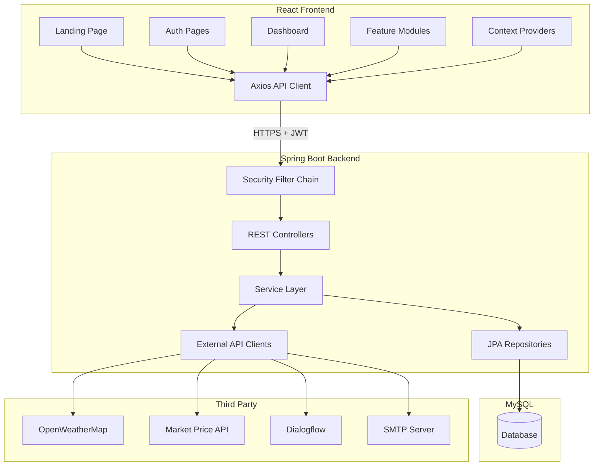

# System Architecture – AgroPulse

## 1. Architecture Style

AgroPulse follows a **three-tier client-server architecture** with clear separation between presentation, business logic, and data layers.

```
┌────────────────────────────────────────────────────────────────────────┐
│                         PRESENTATION TIER                               │
│  ┌─────────────┐  ┌─────────────┐  ┌─────────────┐  ┌─────────────┐   │
│  │   Pages     │  │ Components  │  │   Context   │  │  Services   │   │
│  │ (React)     │  │ (Reusable)  │  │ (Auth/Theme)│  │  (Axios)    │   │
│  └─────────────┘  └─────────────┘  └─────────────┘  └─────────────┘   │
└────────────────────────────────┬───────────────────────────────────────┘
                                 │ HTTP/JSON + JWT
┌────────────────────────────────▼───────────────────────────────────────┐
│                         APPLICATION TIER                                │
│  ┌─────────────┐  ┌─────────────┐  ┌─────────────┐  ┌─────────────┐   │
│  │ Controllers │→ │  Services   │→ │ Repositories│  │   Security  │   │
│  │  (REST)     │  │ (Business)  │  │   (JPA)     │  │  (JWT/CORS) │   │
│  └─────────────┘  └──────┬──────┘  └─────────────┘  └─────────────┘   │
│                          │                                              │
│  ┌───────────────────────▼──────────────────────────────────────────┐  │
│  │              External API Integration Layer                       │  │
│  │   WeatherService │ MarketService │ DialogflowService │ Email     │  │
│  └──────────────────────────────────────────────────────────────────┘  │
└────────────────────────────────┬───────────────────────────────────────┘
                                 │ JDBC
┌────────────────────────────────▼───────────────────────────────────────┐
│                           DATA TIER                                     │
│                        MySQL Database                                   │
│   users │ profiles │ weather_history │ market_prices │ irrigation...   │
└────────────────────────────────────────────────────────────────────────┘
```

## 2. Component Diagram



## 3. Deployment Architecture

```
                    ┌─────────────────┐
                    │   User Browser  │
                    └────────┬────────┘
                             │
              ┌──────────────┴──────────────┐
              │                             │
    ┌─────────▼─────────┐         ┌─────────▼─────────┐
    │  Static Hosting   │         │  App Server       │
    │  (React Build)    │         │  Spring Boot JAR  │
    │  Port: 80/443     │         │  Port: 8080       │
    └───────────────────┘         └─────────┬─────────┘
                                            │
                                  ┌─────────▼─────────┐
                                  │   MySQL Server    │
                                  │   Port: 3306      │
                                  └───────────────────┘
```

## 4. Security Architecture

```
Request Flow:
─────────────
Client Request
    │
    ▼
CORS Filter ──► JWT Auth Filter ──► Controller
    │                  │
    │                  ├── Valid Token → Set SecurityContext
    │                  └── Invalid/Missing → 401 (protected routes)
    │
    ▼
Input Validation (@Valid DTOs)
    │
    ▼
Service Layer (BCrypt for passwords)
    │
    ▼
JPA Repository (parameterized queries)
```

### Security Measures

| Layer | Mechanism |
|-------|-----------|
| Transport | HTTPS in production |
| Authentication | JWT (HS256), 24h / 7d (remember me) |
| Authorization | Role: FARMER, route-level protection |
| Password | BCrypt strength 12 |
| API Keys | Environment variables, backend only |
| CORS | Whitelist frontend origin |
| XSS | React auto-escaping + security headers |

## 5. Data Flow – Key Modules

### 5.1 Authentication Flow

```
Signup → Validate → BCrypt Hash → Save User → Create Profile → Return JWT
Login  → Find User → Verify Password → Generate JWT → Return Token + User
```

### 5.2 Weather Flow

```
User enters city → Frontend calls /api/weather/current?city=X
                 → Backend calls OpenWeatherMap
                 → Save to weather_history
                 → Return formatted DTO + 7-day forecast
```

### 5.3 Chatbot Flow

```
User message → POST /api/chatbot/message
            → Backend forwards to Dialogflow (or rule-based fallback)
            → Save to chat_history
            → Return bot response + suggestions
```

## 6. Technology Mapping

| Concern | Technology |
|---------|------------|
| UI Framework | React 18 + Bootstrap 5 |
| State Management | Context API (Auth, Theme, Notifications) |
| Routing | React Router DOM v6 |
| HTTP Client | Axios with interceptors |
| Charts | Chart.js + react-chartjs-2 |
| Backend Framework | Spring Boot 3.2 |
| ORM | Spring Data JPA + Hibernate |
| Auth | Spring Security + jjwt |
| Build (BE) | Maven |
| Build (FE) | Vite |
| DB | MySQL 8 |

## 7. Design Patterns Used

| Pattern | Application |
|---------|-------------|
| MVC | React pages + Spring controllers |
| Repository | JPA repositories for data access |
| DTO | Request/response separation from entities |
| Service Layer | Business logic isolation |
| Singleton | Spring beans |
| Observer | React Context state updates |
| Strategy | Irrigation recommendation rules |
| Factory | Notification creation by type |

## 8. Error Handling Strategy

```
Frontend:
  Axios interceptor → 401 redirect to login
  Toast notifications for success/error
  Empty states for no data
  Loading skeletons during fetch

Backend:
  @ControllerAdvice GlobalExceptionHandler
  Custom exceptions: ResourceNotFound, BadRequest, Unauthorized
  Standardized ApiResponse wrapper
  HTTP status codes: 200, 201, 400, 401, 404, 500
```

## 9. Scalability Considerations

- Stateless JWT enables load-balanced backend instances
- Database connection pooling (HikariCP)
- Indexed columns on user_id, crop_name, state, created_at
- External API response caching (weather: 30 min, market: 1 hour)
- Pagination on list endpoints (default 20 items)

---

*AgroPulse System Architecture Document v1.0*
