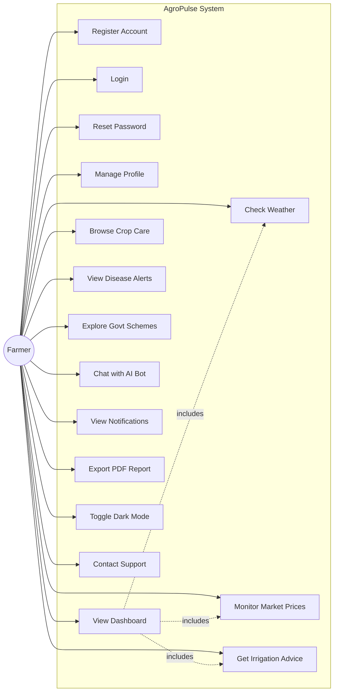
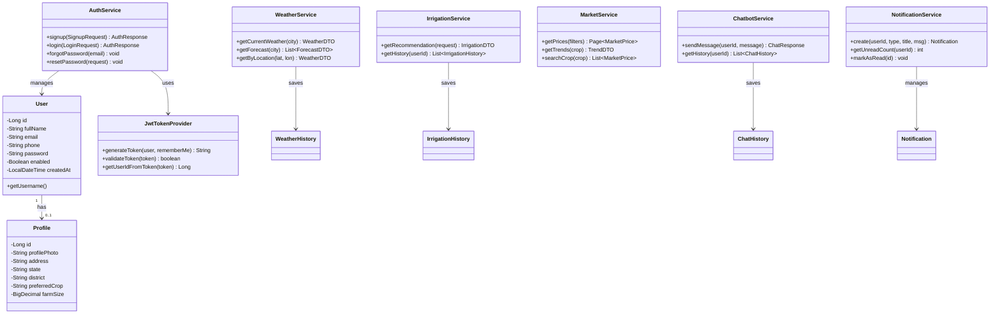
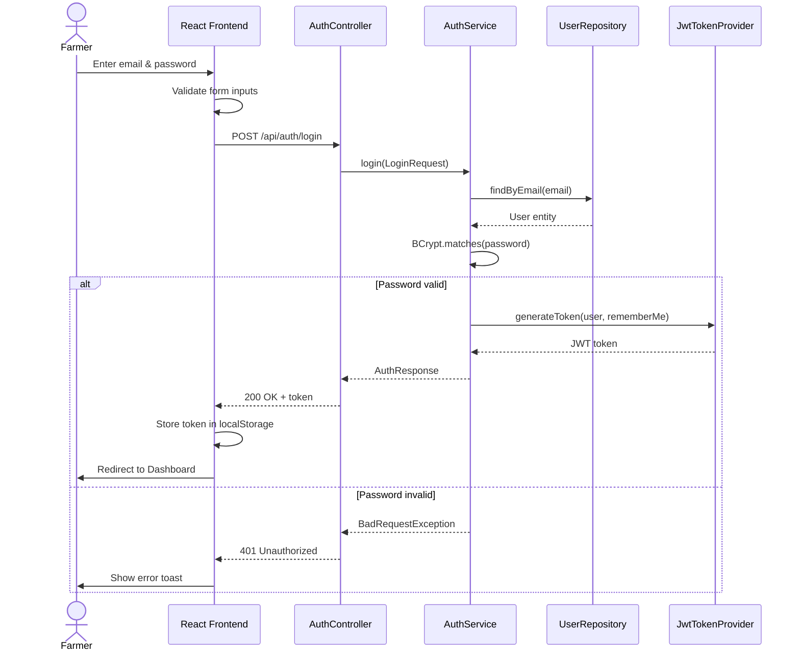
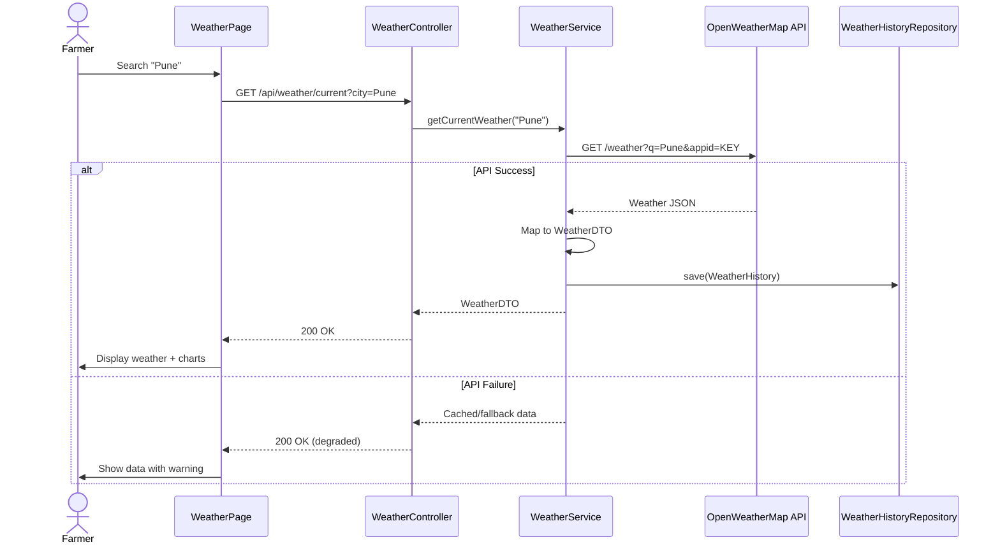
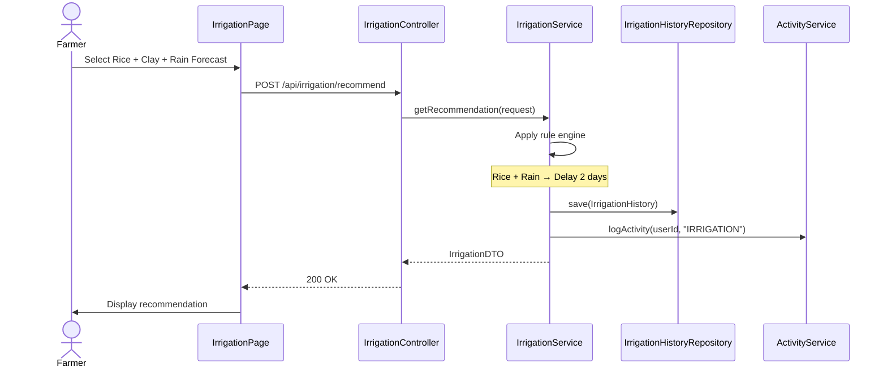
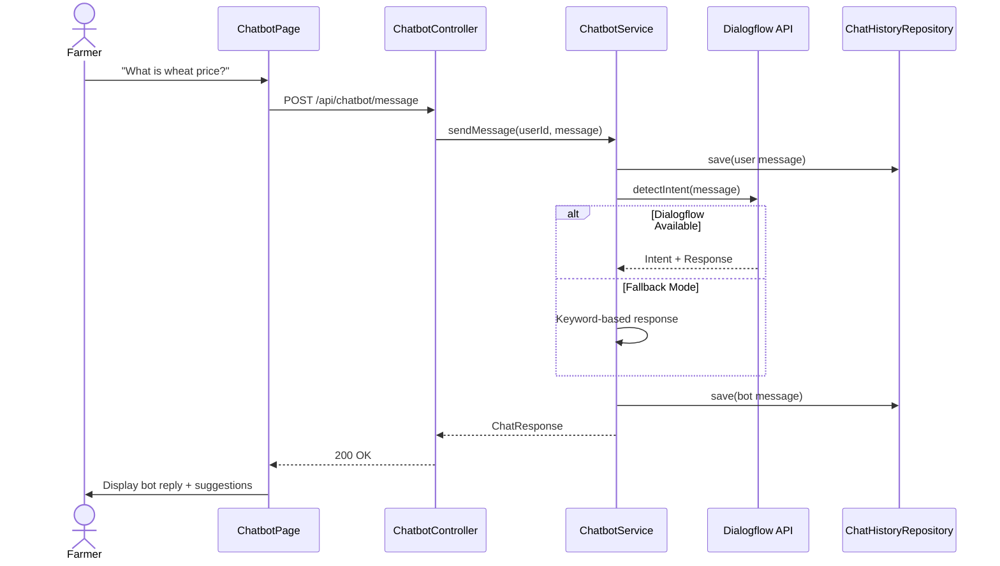
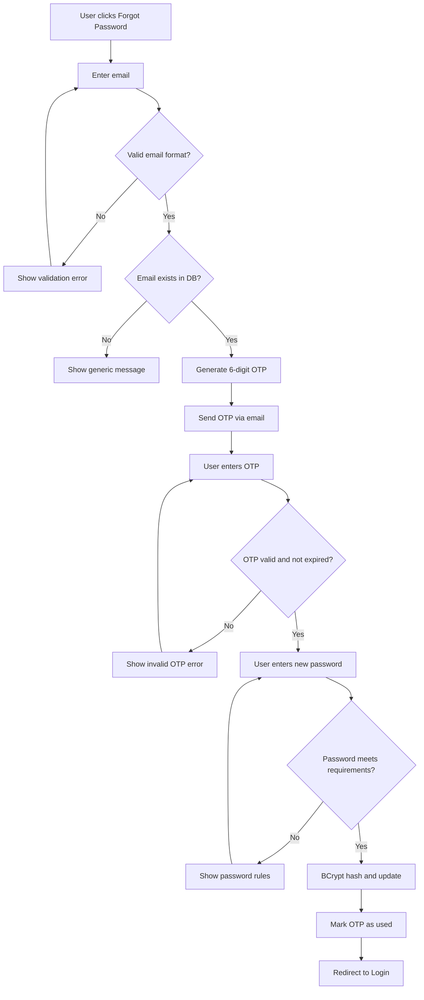

# UML Diagrams – AgroPulse

## 1. Use Case Diagram

### Use Case Descriptions

| ID | Use Case | Actor | Description |
|----|----------|-------|-------------|
| UC1 | Register | Farmer | Create account with validated credentials |
| UC2 | Login | Farmer | Authenticate and receive JWT token |
| UC3 | Reset Password | Farmer | OTP-based password recovery |
| UC4 | Manage Profile | Farmer | Edit personal and farm details |
| UC5 | View Dashboard | Farmer | See aggregated farm insights |
| UC6 | Check Weather | Farmer | Search and view weather forecasts |
| UC7 | Monitor Prices | Farmer | View and analyze crop market prices |
| UC8 | Irrigation Advice | Farmer | Get water scheduling recommendations |
| UC9 | Crop Care | Farmer | Read crop health and fertilizer tips |
| UC10 | Disease Alerts | Farmer | View disease warnings and treatments |
| UC11 | Govt Schemes | Farmer | Browse and save government schemes |
| UC12 | AI Chatbot | Farmer | Ask questions via Dialogflow bot |
| UC13 | Notifications | Farmer | Receive and manage alerts |

---

## 2. Class Diagram

---

## 3. Sequence Diagram – User Login

---

## 4. Sequence Diagram – Weather Forecast

---

## 5. Sequence Diagram – Irrigation Recommendation

---

## 6. Sequence Diagram – Chatbot Interaction

---

## 7. Activity Diagram – Forgot Password

---

*AgroPulse UML Diagrams v1.0*
